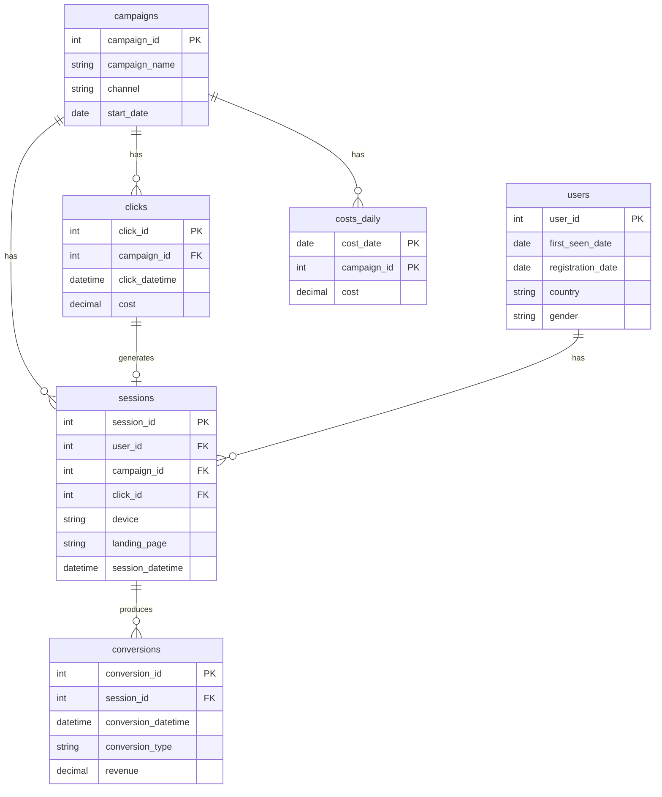

# Marketing Performance Analytics (SQL Server)

## Project Overview
This project simulates a marketing analytics database in SQL Server, enabling analysis of campaign performance across clicks, sessions, conversions, revenue, and spend.  
It is built as an interview-ready portfolio project: clean schema, reproducible seed data, analytical views, stored procedures, and a runnable demo query pack.

## What This Demonstrates
- Relational modeling + constraints (schemas, PK/FK, identity)
- Analytics logic (joins, aggregation, window functions)
- KPI design with safe division patterns (NULLIF)
- Reusable analytical layer (views + stored procedures)
- Cohort thinking (D0 / D7 / D30 windows) for insight stories

---

## Repo Structure (SQL)
- `01_tables.sql` – creates schema + core tables (marketing.*)
- `06_schema_clicks.sql` – adds/updates schema objects required for the clicks model (Stage 2)
- `07_seed_clicks_and_more_data.sql` – Stage 2 seed data (clicks + sessions + conversions + realistic conversion lag)
- `03_views.sql` – analytical views:
  - `vw_sessions_enriched`
  - `vw_campaign_day_kpis` (click-driven daily KPIs)
- `04_procedures.sql` – stored procedures:
  - `sp_campaign_performance`
  - `sp_campaign_day_performance`
  - `sp_upsert_costs_daily` (daily spend upsert example)
- `08_views_cohorts.sql` – cohort views:
  - `vw_click_cohort_cvr_d0_d7_d30`
  - `vw_click_cohort_device_cvr_d0_d7_d30`
- `05_queries_demo.sql` – demo query pack (includes Insight Story + Cohort Analysis sections)

---

## Data Model (schema: `marketing`)
### Tables
- `marketing.campaigns` – campaigns (campaign_name, channel, start_date)
- `marketing.users` – users (first_seen_date, optional registration_date, country, gender)
- `marketing.clicks` – click events (campaign_id, click_datetime, cost)
- `marketing.sessions` – sessions (user_id, campaign_id, click_id, device, landing_page, session_datetime)
- `marketing.conversions` – conversions (session_id, conversion_datetime, conversion_type, revenue)
- `marketing.costs_daily` – daily spend per campaign (cost_date + campaign_id composite PK)

### Key Relationships
- campaign → many clicks / sessions  
- click → zero-or-one session (some orphan clicks exist by design in seed data)  
- user → many sessions  
- session → zero-or-many conversions  
- costs_daily is maintained as a campaign-day "source of truth" example (via MERGE upsert)

### ERD

---

## KPI Definitions
- **CPS** = total conversions / total sessions  
- **CVR (GA4-style)** = sessions with ≥ 1 conversion / total sessions  
  - Implemented by counting each session once if it has at least one conversion.
- **ROAS** = revenue / cost  
  - Daily views/procedures use **click-based cost** (`SUM(clicks.cost)`).

### Attribution Choice (Daily Reporting)
Daily outcomes (conversions/revenue) are aligned to the **session day** (`session_date`), not to `conversion_datetime`.

---

## Analytical Layer
### Views
- `marketing.vw_sessions_enriched`
  - Adds `session_date`
  - Adds `rn_user_session` and `is_new_user_session` based on `ROW_NUMBER()` over user history

- `marketing.vw_campaign_day_kpis`
  - Daily campaign KPIs: clicks, sessions, new vs returning sessions, conversions, first_conversions, revenue, cost, CPS, CVR, ROAS
  - **Click-driven**: built from click-days; sessions/conversions joined by matching activity date

### Stored Procedures
- `marketing.sp_campaign_performance(@start_date, @end_date)`
  - Campaign-level KPIs for a date range (returns campaigns even with 0 activity)
  - Includes clicks, sessions, conversions, first_conversions, revenue, cost, CPS, CVR, ROAS

- `marketing.sp_campaign_day_performance(@start_date, @end_date)`
  - Campaign × date grid for the requested range
  - Joins sessions/conversions by session_date; joins clicks by click_date
  - Includes clicks, sessions, conversions, first_conversions, revenue, cost, CPS, CVR, ROAS

- `marketing.sp_upsert_costs_daily(@cost_date, @campaign_id, @cost)`
  - Upserts daily cost into `marketing.costs_daily` and returns an audit log
  - Included as an example of controlled ingestion via MERGE

---

## Cohort Analysis
### Cohort Views
- `marketing.vw_click_cohort_cvr_d0_d7_d30`
  - Cohort granularity: `campaign_id + cohort_date`
  - Cohort = click cohort by calendar date: `cohort_date = CAST(click_datetime AS DATE)`
  - Windows: D0 / D7 / D30 (calendar-day windows)
  - Measures "converted sessions" in GA4-style (session counted once if it has ≥ 1 conversion)

- `marketing.vw_click_cohort_device_cvr_d0_d7_d30`
  - Same cohort logic, segmented by `device`
  - Sessions-only by design (excludes orphan clicks), because device is a session dimension

### Note on Cohort Windows
Cohort windows are currently **calendar-day based** (cohort_date), not timestamp-accurate windows based on `click_datetime`.  
This can be upgraded later if needed.

---

## Insight Stories
Three analytical stories explore business questions using the data. Full write-ups are in [`insight_stories.md`](insight_stories.md).

**Story 1 — Window Matters (D0 / D7 / D30)**  
D0 reporting misses ~96% of conversions that eventually materialize. D7 captures almost all of the lift (+24pp vs D0 across 5,198 sessions), while extending to D30 adds only 2pp. Finding holds across all campaigns and devices — making D7 the recommended operational window.

**Story 2 — Orphan Clicks: Tracking Guardrail and Wasted Spend**  
~9.5% of paid clicks have no associated session, accounting for ~$1,940 of untracked spend. The rate is stable across campaign-days (p95 ≈ 11.4%), suggesting a consistent baseline tracking loss rather than a one-off incident. Google Search – Brand carries the highest absolute orphan cost and is the priority for any optimization effort.

**Story 3 — Conversion Mix Drives Lag**  
Lead and Registration conversions are nearly complete by D7 (99–100% of eventual volume). Purchase conversions are fundamentally different: only 33% arrive by D7, with most of the lift (66pp) materializing between D7 and D30. Conversion-type mix is nearly identical across all three campaigns, meaning mix is not the driver of between-campaign differences in this dataset.

---

## Notes / Known Limitations
- `vw_campaign_day_kpis` is click-driven: it includes days with clicks, and joins session-based metrics by `session_date`.  
  As a result, sessions that have no associated click (e.g., direct traffic) may be excluded from the daily view.  
  (Acceptable for this demo dataset; can be addressed later with a date grid / activity calendar.)

---

## How to Run
Run scripts in this order:

1. `01_tables.sql`
2. `06_schema_clicks.sql`
3. `07_seed_clicks_and_more_data.sql`
4. `03_views.sql`
5. `04_procedures.sql`
6. `08_views_cohorts.sql`
7. `05_queries_demo.sql`

---

## Quick Demo
- Daily KPIs:
  - `SELECT TOP (50) * FROM marketing.vw_campaign_day_kpis ORDER BY activity_date DESC, campaign_id;`
- Campaign KPIs (range):
  - `EXEC marketing.sp_campaign_performance '2024-02-01','2024-03-31';`
- Campaign-day KPIs (range):
  - `EXEC marketing.sp_campaign_day_performance '2024-02-01','2024-03-31';`
- Cohorts:
  - `SELECT TOP (50) * FROM marketing.vw_click_cohort_cvr_d0_d7_d30 ORDER BY campaign_id, cohort_date;`
  - `SELECT TOP (50) * FROM marketing.vw_click_cohort_device_cvr_d0_d7_d30 ORDER BY campaign_id, cohort_date, device;`

---

## Tech Stack
- SQL Server
- T-SQL (tables, constraints, views, stored procedures, window functions)
